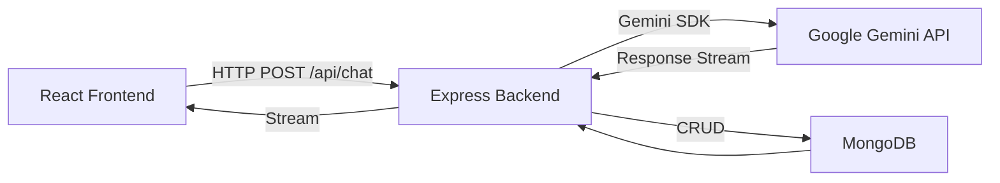
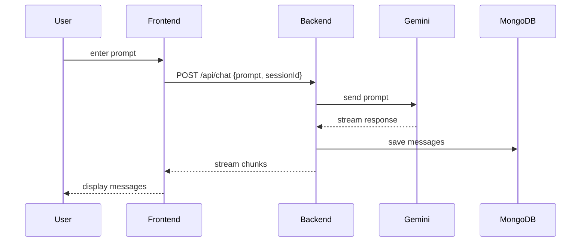

## cogniG

A full‑stack chat application built with the MERN stack and powered by Google’s Gemini AI. cogniG provides a real‑time chat interface with streaming AI responses and persistent conversation history.

🔗 [Live Demo](http://cognig.onrender.com)

---

## Tech Stack

| Layer    | Technology        |
| -------- | ----------------- |
| Frontend | React             |
| Backend  | Node.js, Express  |
| Database | MongoDB           |
| AI       | Google Gemini API |

---

## Architecture



*High‑level data and request flow.*

---

## Control Flow



*Detailed sequence of user interaction and streaming.*

---

## Getting Started

1. **Clone repo**

   ```bash
   git clone https://github.com/your-org/cogniG.git
   cd cogniG
   ```

2. **Install & run**

   * **Backend**

     ```bash
     cd backend
     npm install
     npm run dev
     ```
   * **Frontend**

     ```bash
     cd frontend
     npm install
     npm start
     ```

---

## License

MIT
