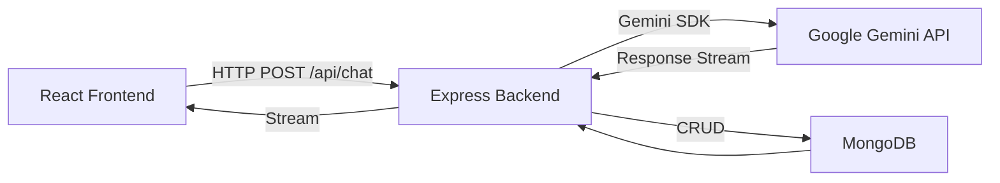
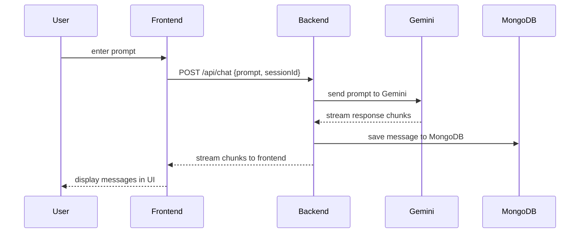

## cogniG

A full‑stack chat application built with the MERN stack and powered by Google’s Gemini AI. cogniG provides a real‑time chat interface with streaming AI responses and persistent conversation history.

---

## Tech Stack

| Layer    | Technology        |
| -------- | ----------------- |
| Frontend | React             |
| Backend  | Node.js, Express  |
| Database | MongoDB           |
| AI       | Google Gemini API |

---

## Architecture

*High‑level data and request flow.*

---

## Control Flow

