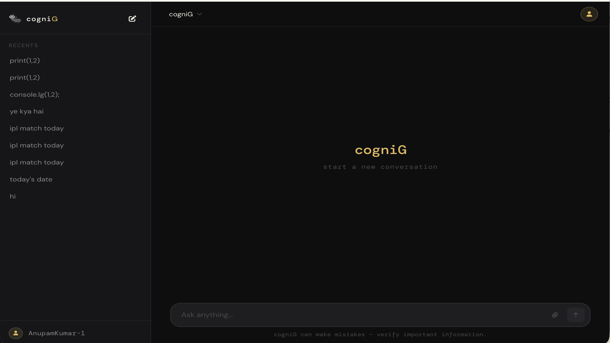
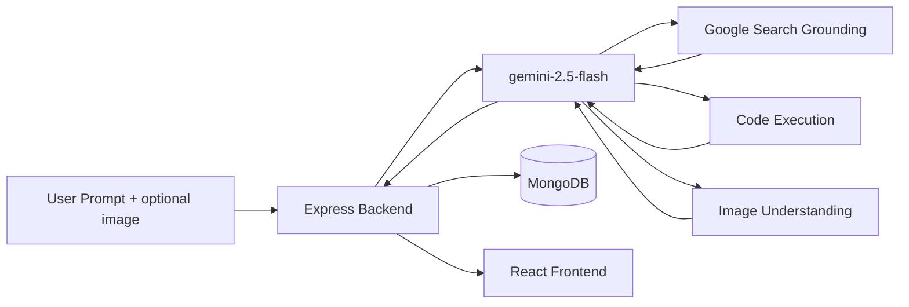
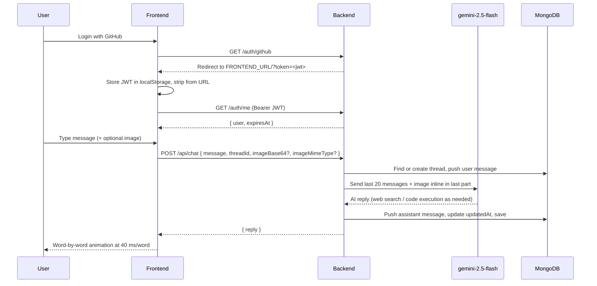

# cogniG

cogniG is a multimodal AI chat platform that combines persistent conversational memory, real-time web grounding, image understanding, and Gemini-powered code execution inside a full-stack MERN architecture.

**Live Demo:** https://cognig.onrender.com



---

## Tech Stack

| Layer    | Technology                                          |
| -------- | --------------------------------------------------- |
| Frontend | React 19, Vite                                      |
| Backend  | Node.js, Express 5                                  |
| Database | MongoDB (Mongoose 8)                                |
| AI       | Google Gemini (`gemini-2.5-flash`)                  |
| Auth     | GitHub OAuth 2.0 (`passport-github2`) + JWT (7d)   |
| Hosting  | Render (Frontend + Backend, separately deployed)    |

---

## Features

- Multimodal prompts — image (PNG, JPEG, WEBP, GIF) attached inline with text
- Google Search grounding tool for live web information
- Sandboxed code execution tool for Python and math workflows
- Context-aware threaded conversations persisted in MongoDB
- Sliding context window — last 20 messages sent per Gemini request
- Thread titles auto-generated from the first 50 characters of the opening message
- GitHub OAuth login with stateless JWT session management (7-day expiry)
- Thread management — create, switch, delete
- Markdown rendering with syntax highlighting (`react-markdown` + `rehype-highlight` + `highlight.js github-dark`)
- Word-by-word response animation (40 ms interval, space-split)
- Image preview with removal before sending
- Auto-scroll to latest message

---

## Project Structure

```
cogniG/
├── Backend/
│   ├── config/
│   │   └── passport.js          # GitHub OAuth strategy (passport-github2)
│   ├── models/
│   │   ├── User.js              # GitHub user schema (githubId, username, email)
│   │   └── Thread.js            # Thread + message schema (threadId, title, messages[], author)
│   ├── routes/
│   │   ├── auth.js              # OAuth callback, JWT issue, /auth/me, ensureAuthenticated middleware
│   │   └── chat.js              # Thread CRUD + POST /api/chat
│   ├── utils/
│   │   └── getGeminiResponse.js # Gemini API integration (googleSearch + codeExecution tools)
│   └── server.js                # Express 5 app, CORS, Mongoose connect, global error handler
└── Frontend/
    └── src/
        ├── App.jsx              # JWT extraction from URL params, /auth/me check, context provider
        ├── Sidebar.jsx          # Thread list, create/switch/delete, uuid-v1 thread IDs
        ├── ChatWindow.jsx       # Input, image upload (FileReader → base64), send logic, logout
        ├── Chat.jsx             # Message rendering, word-by-word animation, auto-scroll
        ├── MyContext.jsx        # Global state context (createContext)
        └── components/
            └── LoginModal.jsx   # GitHub OAuth redirect modal
```

---

## Architecture

```mermaid
flowchart LR
  subgraph Auth
    U[Browser] -->|GitHub OAuth| GH[GitHub]
    GH -->|Callback| B[Express Backend]
    B -->|JWT in redirect URL| U
  end

  U -->|Bearer JWT| B
  B -->|Mongoose| D[MongoDB]
  B -->|@google/genai SDK| G[gemini-2.5-flash]
  G --> S[Google Search Grounding]
  G --> C[Code Execution Tool]
  B -->|JSON reply| F[React Frontend]
  F --> U
```

---

## AI Tooling Pipeline

Each request sends the last 20 messages as context. Gemini selects tools autonomously — web search, code execution, image understanding, or none — depending on the prompt.


```mermaid
flowchart LR
  U[User Prompt + optional image] --> B[Express Backend]
  B --> G[gemini-2.5-flash]

  G --> W[Google Search Grounding]
  G --> X[Code Execution]
  G --> I[Image Understanding]

  W --> G
  X --> G
  I --> G

  G --> B
  B --> M[(MongoDB)]
  B --> F[React Frontend]
```

**Gemini config:**
- `temperature: 0.7`
- `maxOutputTokens: 8192`
- Tools: `googleSearch: {}`, `codeExecution: {}`
- Image is attached only to the last message's `parts[]` in the contents array

---

## Sequence Flow


```mermaid
sequenceDiagram
  participant U as User
  participant F as Frontend
  participant B as Backend
  participant G as gemini-2.5-flash
  participant M as MongoDB

  U->>F: Login with GitHub
  F->>B: GET /auth/github
  B-->>F: Redirect to FRONTEND_URL/?token=<jwt>
  F->>F: Store JWT in localStorage, strip from URL
  F->>B: GET /auth/me (Bearer JWT)
  B-->>F: { user, expiresAt }

  U->>F: Type message (+ optional image)
  F->>B: POST /api/chat { message, threadId, imageBase64?, imageMimeType? }
  B->>M: Find or create thread, push user message
  B->>G: Send last 20 messages + image inline in last part
  G-->>B: AI reply (web search / code execution as needed)
  B->>M: Push assistant message, update updatedAt, save
  B-->>F: { reply }
  F-->>U: Word-by-word animation at 40 ms/word
```

---

## Tool Execution Lifecycle

```
User prompt (+ optional base64 image)
    └─▶ Backend strips data-URL prefix from base64
    └─▶ Thread fetched or created in MongoDB
    └─▶ Full thread history sliced to last 20 messages
    └─▶ Image attached to parts[] of the last message only
    └─▶ Sent to gemini-2.5-flash via @google/genai
            ├─▶ [if needed] Google Search → results injected into context
            ├─▶ [if needed] Code Execution → stdout/result injected
            └─▶ Final response.text returned
    └─▶ Assistant message saved to MongoDB thread
    └─▶ { reply } returned to frontend
    └─▶ Frontend animates reply word-by-word (space-split, 40 ms interval)
```

---

## API

### POST /api/chat

Request:
```json
{
  "message": "Explain quicksort",
  "threadId": "uuid-v1-string",
  "imageBase64": "optional-base64-without-data-url-prefix",
  "imageMimeType": "image/png"
}
```

Response:
```json
{
  "reply": "..."
}
```

### GET /api/thread

Returns all threads for the authenticated user sorted by `updatedAt` descending. Each entry includes `threadId` and `title`.

### GET /api/thread/:threadId

Returns the `messages` array for a given thread (`role`, `content`, `timestamp`).

### DELETE /api/thread/:threadId

Deletes a thread. Returns `{ success: "Thread deleted successfully" }`.

### GET /auth/me

Returns the authenticated user and token expiry:
```json
{
  "user": { "id": "...", "username": "...", "email": "..." },
  "expiresAt": "2026-05-22T00:00:00.000Z"
}
```

---

## Data Models

### User

```js
{
  githubId: String,   // unique — from GitHub profile.id
  username: String,
  email: String       // profile.emails[0].value or ""
}
```

### Thread

```js
{
  threadId: String,   // uuid-v1, unique
  title: String,      // first 50 chars of opening message (truncated with "…")
  messages: [
    { role: "user" | "assistant", content: String, timestamp: Date }
  ],
  author: ObjectId,   // ref: User
  createdAt: Date,
  updatedAt: Date
}
```

---

## Security

- Authentication uses GitHub OAuth 2.0 — no passwords stored
- JWT tokens are signed with a server-side secret and expire in 7 days
- JWTs are stored in `localStorage` and sent as `Authorization: Bearer` headers
- Token is extracted from the redirect URL query param and immediately stripped via `window.history.replaceState`
- All `/api/*` and `/auth/me` routes are protected by `ensureAuthenticated` JWT middleware
- CORS is restricted to `FRONTEND_URL` only
- Express JSON body limit is set to `10mb` to accommodate base64 image payloads

---

## Environment Variables

**Backend `.env`**

```
PORT=8080
MONGODB_URI=
GITHUB_CLIENT_ID=
GITHUB_CLIENT_SECRET=
GITHUB_CALLBACK_URL=https://cognigbackend.onrender.com/auth/github/callback
JWT_SECRET=
FRONTEND_URL=https://cognig.onrender.com
GEMINI_API_KEY=
```

**Frontend `.env`**

```
VITE_BACKEND_URL=https://cognigbackend.onrender.com
```

---

## Getting Started

**Clone repo**

```bash
git clone https://github.com/AnupamKumar-1/cogniG.git
cd cogniG
```

**Backend**

```bash
cd Backend
npm install
node server.js
```

**Frontend**

```bash
cd Frontend
npm install
npm run dev
```

In development, Vite proxies `/auth/*` and `/api/*` to `VITE_BACKEND_URL` automatically via `vite.config.js`.

---

## Key Frontend Dependencies

| Package | Purpose |
| ------- | ------- |
| `react-markdown` | Render AI responses as Markdown |
| `rehype-highlight` | Syntax highlighting in code blocks |
| `highlight.js` (`github-dark` theme) | Code block styles |
| `react-spinners` (`ScaleLoader`) | Loading indicator during API call |
| `uuid` (v1) | Generate unique thread IDs client-side |

---

## Deployment

Frontend and backend are deployed separately on Render as static site and web service respectively.

- Frontend: https://cognig.onrender.com
- Backend: https://cognigbackend.onrender.com

---

## License

MIT